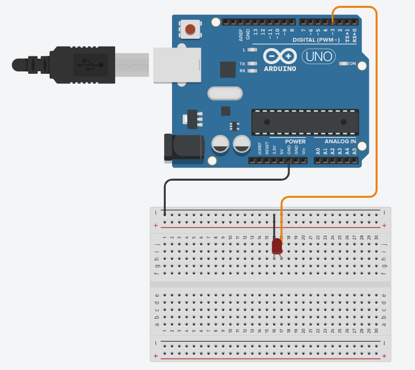

:construction: Projeto em desenvolvimento !! :construction:

<h2 align="center">
  

  symphony arduino
  

</h2>

  
  
  

    
    
  

  
## :scroll: Sobre

Um programa para arduino que se conecta ao reprodutor de músicas <a href="https://github.com/josereia/symphony-desktop"><b>symphony-desktop</b></a> através da porta serial. O objetivo é sincronizar a cor de uma fita de led comum com a cor de destaque da capa do album que está tocando.

Para isso, foi utilizado a porta serial do arduino que recebe a cor de destaque rgb, compara com as cores pré-definidas da fita de led e emite o comando/código correto através da biblioteca IRemote para o led infravermelho que transmite esse comando para a controladora da fita de led.

No <a href="https://github.com/josereia/symphony-desktop"><b>symphony-desktop</b></a> foi usado um algoritimo de aproximação de cores para pegar a cor da fita de led mais próxima da cor de destaque do album, haja vista que as cores da fita de led comum são limitadas.

## 🧰 Tecnologias usadas
>Até o momento.
- C++
- IRremote
- Arduino

## :computer: Plataformas suportadas
>Até o momento.

  
  

## 📷 Imagens do projeto
>Esquema do arduino

Led infravermelho ligado ao pino 3.

  

>Preview

Projeto rodando no Arduino Uno em conjunto ao reprodutor de músicas symphony-desktop.

  
